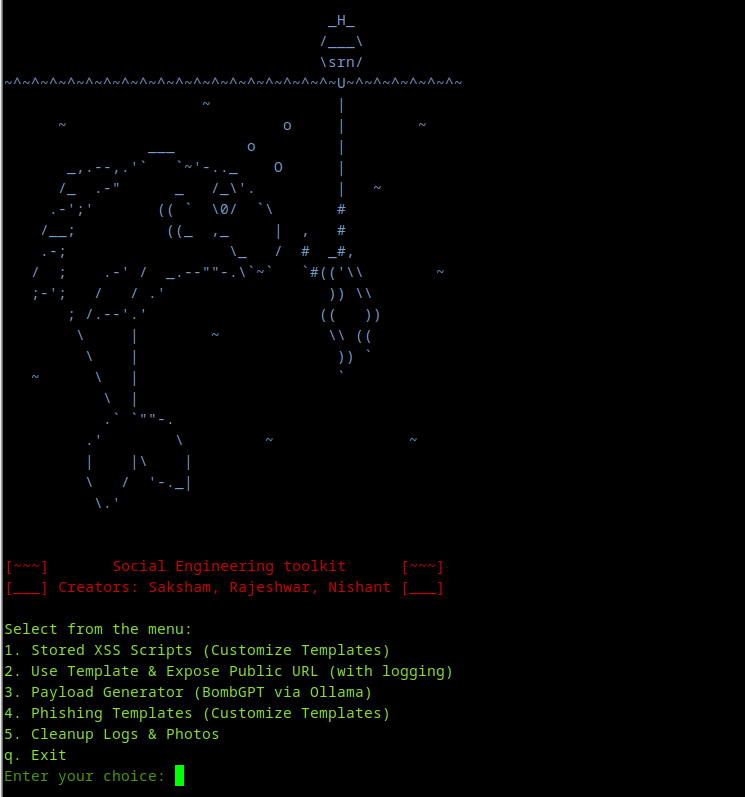

# 🛡 Social Engineering Toolkit (CLI-Based)  
A Python Toolkit for Ethical Hacking & Phishing Simulation

## 🚀 Overview

This project is a *CLI-based Social Engineering Toolkit* built during a cybersecurity internship program. It is designed to *simulate real-world social engineering attacks* such as phishing and stored XSS, and provides a controlled, ethical environment for cybersecurity education and penetration testing.

> *Note:* This tool is for *educational purposes only* and should be used responsibly.

---


## ⚙ Features

- 🎣 *Phishing Page Deployment* (with webcam/photo & GPS capture)
- 💥 *Stored XSS Payload Customization* (template-based)
- 🔗 *URL Masking* using [Facad1ng](https://github.com/spyboy-productions/Facad1ng)
- ☁ *Cloudflare Tunneling Integration* 
- 📷 *QR Code Generation*
- 🤖 *Payload Generator* using LLM API
- 📁 *Data Logging* (IP address, photo, GPS, input/credentials)
- 🧼 *Auto Cleanup Utility* to delete sensitive files
- 📜 *Modular CLI Interface* for easy navigation

---

## 📁 Directory Structure

```bash
socialengineeringtoolkit_V1.0/
├── templates/              # XSS & payload templates
├── templates2/             # Final phishing templates
├── ADDING LOCATION .../    # Captured logs/images
├── setool.py               # Main script
``` 
